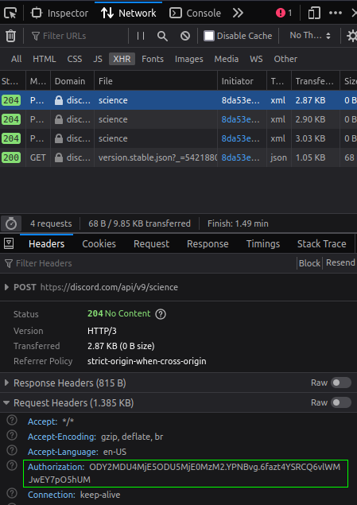

<p align="center">
  <a href="https://github.com/danielhe4rt/disco-the-ripper" target="_blank">
    
  </a>
</p>

# Disco the Ripper

Disco the Ripper was created to rip all messages from a Discord specific channel into JSON via CLI and help people to investigate 
some servers who has awkward channels before they get deleted. 

This project was designed with [Laravel Zero](https://laravel-zero.com).

## Installation

### 1. Install the dependencies

Use the package manager [composer](https://getcomposer.org) to install Disco the Ripper.

Go to the project folder after install Composer and run the command below:
```bash
composer install
```

### 2. Setup your credentials

#### Authorization Token

After everything get installed you should create or make copy the `.env.example` and rename it to `.env`.

The env file should contain one key called `AUTHORIZATION` and you should assign his value with your **Discord Web Authorization Token**.
To get this token, open your Discord App or on the Browser and open the Inspection Page.

- To open Inspection Tab on Discord press `CTRL + SHIFT + I`
- To open Inspection Tab on Browser, Press F12

There you will click on `Network` tab and filter all `XHR` requests:


After that you will select any request (red square) to get the Authorization Header:



If you got your Authorization Token, put it on your `.env` file and you should see something like:

#### User ID

Go to your Discord Settings and enable the **Developer Mode**.


After that, send any message in any chat on your Discord account and click with the Right button and select the **Copy ID* option.


If you paste (CTRL + V) some numbers should appears and should be like: **866058219859214336**.

Your env should have this two tokens to run the project.

```dotenv
USER_ID=866058219859214336
AUTHORIZATION="ODY2MDU4MjE5ODU5MjE0MzM2.xxxxx.6fazt4YSRCQ6vlWMJwEY7pO5hUM"
```

## Usage

To start the project, run the command below and select which server/channel you want to retrieve.

```bash
php artisan ripper:start
```

## Contributing
Pull requests are welcome. For major changes, please open an issue first to discuss what you would like to change.

## License
[MIT](https://choosealicense.com/licenses/mit/)
